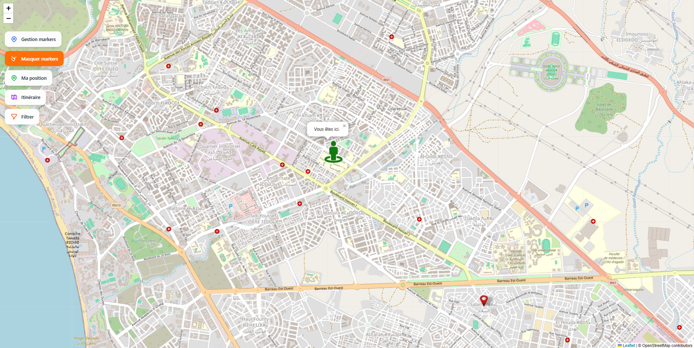
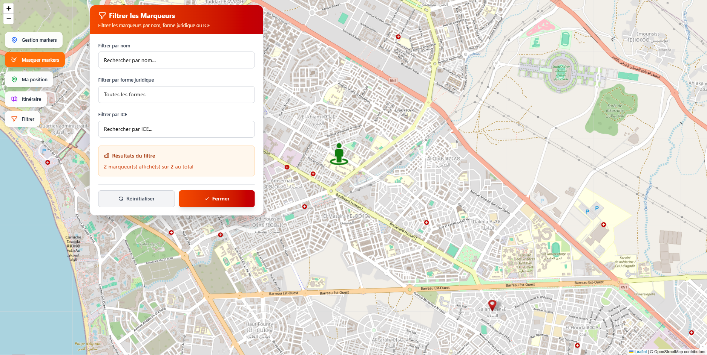

# 🌍 Leaflet Marker Manager

**Leaflet Marker Manager** est une application web interactive moderne permettant la gestion avancée de marqueurs géolocalisés sur carte. Elle propose une différenciation par type (`COOPERATIVE`, `ENTREPRISE`, `ASSOCIATION`), un système de filtrage intelligent, le positionnement de l'utilisateur, le traçage d'itinéraires, et la persistance des données via un backend Flask connecté à MongoDB.

---

##  Fonctionnalités principales

### 🗺️ Cartographie Interactive
-  **Carte interactive** basée sur OpenStreetMap et Leaflet.js
-  **Interface responsive** avec design moderne utilisant Tailwind CSS

### 📍 Gestion des Marqueurs
-  **Ajout de marqueurs** avec formulaire complet incluant :
  - Nom, coordonnées GPS (avec géocodage automatique)
  - Activité commerciale
  - Adresse complète compatible OpenStreetMap :  
    `addr:housenumber`, `addr:street`, `addr:postcode`, `addr:province`, `addr:place`
  - Contact : téléphone, fax, e-mail
  - Informations légales : RC, ICE
  - Type juridique : `COOPERATIVE`, `ENTREPRISE`, `ASSOCIATION`
-  **Icônes personnalisées** selon le type de marqueur (bleu, jaune, rouge)
-  **Affichage et recentrage** sur chaque marqueur avec popups détaillées
-  **Suppression** des marqueurs via l'interface avec synchronisation MongoDB

### 💾 Interface de Gestion
-  **Interface modulaire** avec modales animées
-  **3 sections organisées** :
  - `Informations Générales`
  - `Localisation Géographique`
  - `Informations de Contact`

  
### 🧭 Navigation et Itinéraires
-  **Localisation utilisateur** avec recentrage automatique et icône dédiée
-  **Itinéraire interactif** entre deux points (marqueurs ou position utilisateur)
-  **Informations de route** : distance en km et temps estimé
-  **Sélection flexible** des points de départ et d'arrivée
-  **Gestion des routes** avec suppression facile

### 🔍 Système de Filtrage Avancé
-  **Filtrage multi-critères** par nom, forme juridique, et numéro ICE
-  **Recherche en temps réel** avec mise à jour instantanée
-  **Recherche insensible à la casse** et correspondance partielle
-  **Résumé des filtres** avec compteur de marqueurs visibles
-  **Intégration carte** - les marqueurs filtrés sont masqués/affichés automatiquement


---

## 🛠️ Technologies utilisées

| Composant           | Technologie                    | Version    |
|--------------------|--------------------------------|------------|
| **Frontend**        | Angular (Standalone Components) | 19+        |
| **Cartographie**    | Leaflet.js + Routing Machine   | Latest     |
| **Styling**         | Tailwind CSS                   | 3.x        |
| **Backend**         | Python Flask                   | 2.x        |
| **Base de données** | MongoDB (local ou Atlas)       | 6.x+       |
| **API REST**        | GET, POST, DELETE              | -          |
| **Géocodage**       | Nominatim (OpenStreetMap)      | -          |

---

## 📸 Captures d'écran

### 🗺️ Interface principale avec contrôles
  
> Interface moderne avec boutons de contrôle (Gestion, Position, Itinéraire, Filtrer) et design glass morphism.

### 📌 Localisation utilisateur
  
> Géolocalisation automatique avec icône utilisateur personnalisée et popup d'information.

### ➕ Ajout de marqueurs
  
  
> Interface de création de marqueurs avec formulaire structuré en sections et validation.


### 🛣️ Traçage d'itinéraire
  
> Système de routage avec sélection de points et affichage des informations de trajet (distance/temps).

### 🔍 Système de filtrage
  
> Modal de filtrage permettant la recherche par nom, forme juridique et numéro ICE avec résumé en temps réel.


---

## 🧑‍💻 Installation & Lancement

### Prérequis
- Node.js 18+ et Angular CLI 19+
- Python 3.8+ et pip
- MongoDB (local ou Atlas)

### 1. Backend (Flask + MongoDB)

```bash
# Cloner le repository
git clone https://github.com/AvoCahDoe/Leaf.git
cd Leaf/backend

# Créer l'environnement virtuel
python -m venv venv
source venv/bin/activate  # Windows: venv\Scripts\activate

# Installer les dépendances
pip install -r requirements.txt

# Configurer MongoDB (local ou Atlas)
# Modifier la chaîne de connexion dans app.py si nécessaire

# Lancer le serveur Flask
python app.py
# Backend disponible sur http://localhost:5000
```

### 2. Frontend (Angular 19)

```bash
# Aller dans le dossier frontend
cd ../leaf

# Installer les dépendances Node.js
npm install

# Lancer le serveur de développement
ng serve -o
# Application disponible sur http://localhost:4200
```

---

## 📁 Structure du projet

```bash
Leaf-App/
│
├── back-leaf/
│   ├── app.py                    # Serveur Flask principal
│   ├── requirements.txt          # Dépendances Python
│   └── models/                   # Modèles de données
│
├── leaf/                         # Application Angular
│   ├── src/app/
│   │   ├── map/
│   │   │   ├── map.ts           # Logique principale du composant
│   │   │   ├── map.html         # Template avec modales
│   │   │   └── map.scss         # Styles et animations
│   │   ├── app.ts               # Composant racine
│   │   ├── app.routes.ts        # Configuration des routes
│   │   └── app.config.ts        # Configuration Angular
│   │
│   └── assets/                   # Ressources statiques
│       ├── blue.png             # Icône COOPERATIVE
│       ├── yellow.png           # Icône ENTREPRISE  
│       ├── red.png              # Icône ASSOCIATION
│       ├── UserIcon.png         # Icône utilisateur
│       └── leaf-shadow.png      # Ombre des marqueurs
│
└── README.md
```

---

## 💾 Modèle de données MongoDB

```json
{
  "_id": {
    "$oid": "676f8a2c4d2b1e3f5a7c9d8e"
  },
  "name": "Coopérative Agricole Atlas",
  "lat": 31.6295,
  "lng": -7.9811,
  "activity": "Agriculture biologique",
  "address": "Avenue Hassan II",
  "city": "Marrakech",
  "phone": "+212 6 12 34 56 78",
  "fax": "+212 5 24 12 34 56",
  "email": "contact@coop-atlas.ma",
  "rc": "RC45789",
  "ice": "001234567000078",
  "form": "COOPERATIVE",
  "addr_housenumber": "125",
  "addr_street": "Avenue Hassan II",
  "addr_postcode": "40000",
  "addr_province": "Marrakech-Safi",
  "addr_place": "Gueliz"
}
```

---

## 🔧 Configuration API

### Endpoints disponibles

```http
GET    /markers          # Récupérer tous les marqueurs
POST   /markers          # Créer un nouveau marqueur  
DELETE /markers/:id      # Supprimer un marqueur par ID
```

### Format de requête POST

```json
{
  "name": "Nom requis",
  "lat": 31.6295,
  "lng": -7.9811,
  "form": "COOPERATIVE|ENTREPRISE|ASSOCIATION",
  "activity": "Activité optionnelle",
  "address": "Adresse complète",
  "city": "Ville",
  // ... autres champs optionnels
}
```

---

## 🎯 Guide d'utilisation

### 📍 Ajouter un marqueur
1. Cliquer sur **"Gestion markers"**
2. Remplir le formulaire (nom obligatoire, forme juridique requise)
3. Saisir l'adresse ou les coordonnées GPS directement
4. Le géocodage automatique convertit les adresses en coordonnées
5. Cliquer sur **"Ajouter le Marqueur"**

### 🔍 Filtrer les marqueurs
1. Cliquer sur **"Filtrer"** pour ouvrir la modal
2. Utiliser les filtres seuls ou combinés :
   - **Nom** : recherche textuelle (insensible à la casse)
   - **Forme juridique** : sélection dans liste déroulante
   - **ICE** : recherche par numéro d'identification
3. Les résultats s'affichent en temps réel
4. Utiliser **"Réinitialiser"** pour effacer tous les filtres

### 🛣️ Créer un itinéraire
1. Cliquer sur **"Itinéraire"**
2. Sélectionner le point de départ (position utilisateur ou marqueur)
3. Choisir la destination (position utilisateur ou marqueur)
4. Cliquer sur **"Tracer"** pour afficher la route
5. Consulter la distance et le temps estimé

### 📌 Navigation
- **"Ma position"** : centrer la carte sur votre localisation
- **Icône localisation** : centrer sur un marqueur spécifique
- **Icône poubelle** : supprimer un marqueur

---

## ✨ Nouveautés et améliorations

###  Fonctionnalités récentes
-  **Système de filtrage avancé** multi-critères avec recherche temps réel
-  **Interface moderne** avec Tailwind CSS et effets glass morphism
-  **Performance optimisée** avec Angular 19 et standalone components
-  **Géocodage automatique** via Nominatim pour conversion adresse→coordonnées

-  **Animations fluides** et transitions CSS3


###  Améliorations par rapport à la version précédente
- Refactorisation complète de l'interface utilisateur
- Ajout du système de filtrage intelligent
- Amélioration des performances de rendu
- Intégration complète du géocodage automatique

---

## 🐛 Dépannage

### Problèmes courants

**La carte ne se charge pas :**
- Vérifier la connexion internet (tuiles OpenStreetMap)
- Contrôler la console pour les erreurs JavaScript

**Les marqueurs n'apparaissent pas :**
- Vérifier que le backend Flask fonctionne sur le port 5000
- Contrôler la connexion MongoDB
- Vérifier le format des données en base

**Le géocodage ne fonctionne pas :**
- Contrôler la connexion internet
- Vérifier le format de l'adresse saisie
- Le service Nominatim peut avoir des limites de débit

**Les filtres ne répondent pas :**
- Actualiser la page
- Vérifier que les données contiennent les champs filtrés
- Contrôler la console pour les erreurs

---

## Améliorations futures

### 🎯 Prochaines fonctionnalités
-  **Authentification utilisateur** et gestion des sessions
-  **Export/Import** des données (JSON, CSV, GeoJSON)
-  **Déploiement cloud** (Heroku, Render, Vercel)
-  **Tableaux de bord** et statistiques des marqueurs

-  **Couches cartographiques** multiples (satellite, terrain)
-  **API publique** avec documentation OpenAPI

### 🛠️ Améliorations techniques
- Tests unitaires et d'intégration
- Cache intelligent des données
- Surveillance et métriques
- CI/CD automatisé

---


