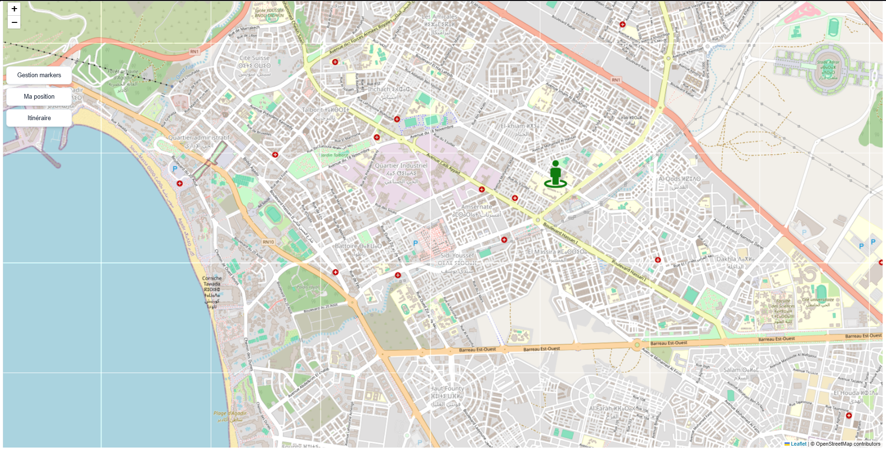
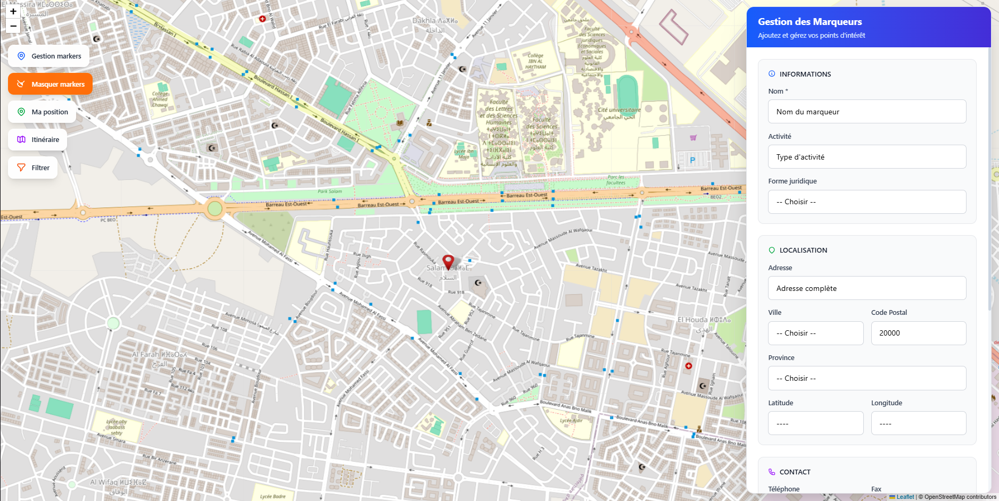
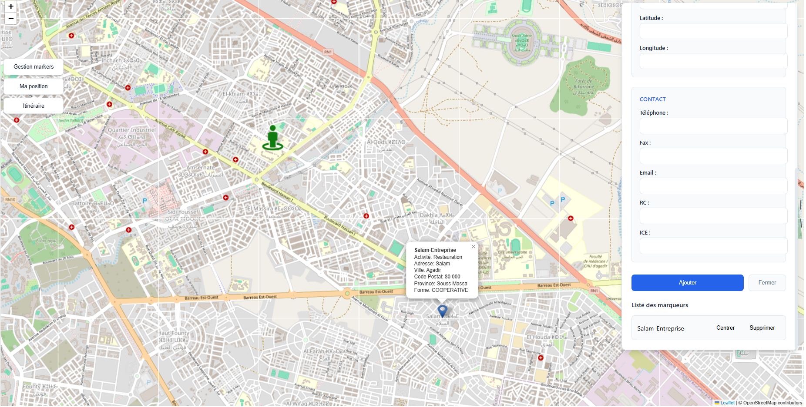

# 🌍 Leaflet Marker Manager

**Leaflet Marker Manager** est une application web interactive permettant la gestion de marqueurs géolocalisés sur carte. Elle propose une différenciation par type (`COOPERATIVE`, `ENTREPRISE`, `ASSOCIATION`), le positionnement de l’utilisateur, le traçage d’itinéraires, et la persistance des données via un backend Flask connecté à MongoDB.

---

## 🚀 Fonctionnalités principales

- 🌐 **Carte interactive** basée sur OpenStreetMap et Leaflet.js  
- ➕ **Ajout de marqueurs** avec les champs suivants :
  - Nom, coordonnées GPS
  - Activité
  - Adresse complète compatible OpenStreetMap :  
    `addr:housenumber`, `addr:street`, `addr:postcode`, `addr:province`, `addr:place`
  - Téléphone, fax, e-mail
  - RC, ICE
  - Type : `COOPERATIVE`, `ENTREPRISE`, `ASSOCIATION`
- 📍 **Icônes personnalisées** selon le type de marqueur
- 👁️ **Affichage et recentrage** sur chaque marqueur
- ❌ **Suppression** des marqueurs via l’interface et suppression en base MongoDB
- 📌 **Localisation utilisateur** avec recentrage automatique
- 🧭 **Itinéraire interactif** entre deux marqueurs enregistrés (via Leaflet Routing Machine)
- 🔢 **Compteur automatique** des marqueurs existants
- 🧩 **Interface de gestion segmentée** en 3 sections :
  - `Infos Générales`
  - `Infos Géo`
  - `Markers existants`

---

## 🛠️ Technologies utilisées

| Côté                | Technologie              |
|--------------------|--------------------------|
| **Frontend**        | Angular 20, Leaflet.js   |
| **Backend**         | Python (Flask)           |
| **Base de données** | MongoDB (local ou Atlas) |
| **API REST**        | GET, POST, DELETE        |

---

## 📸 Captures d’écran

### 🗺️ Localisation utilisateur
  
> En cliquant sur **Ma Position**, le navigateur demande l’autorisation de géolocalisation, puis affiche votre position actuelle sur la carte.

---

### ➕ Ajout de marqueurs
  
  
> Cliquez sur **Gestion de markers** pour remplir les champs d’une entité à enregistrer dans la base de données.

---

### ⚙️ Traçage d'itinéraire
  
> Cliquez sur **Itinéraire**, sélectionnez un point A et un point B parmi les marqueurs existants. L’itinéraire affichera le chemin, la distance et le temps estimé.

---

## 🧑‍💻 Installation & Lancement

### 1. Backend (Flask)

```bash
git clone https://github.com/AvoCahDoe/Leaf.git
cd Leaf/backend
python -m venv venv
source venv/bin/activate  # sous Windows : venv\Scripts\activate
pip install -r requirements.txt
python app.py

```

```bash
cd Leaf/frontend
npm install
ng serve -o
# Accès via http://localhost:4200
```

```bash
Leaf-App/
│
├── back-leaf/
│   └── app.py               # Backend Flask
│
├── leaf/
│   ├── src/app/
│   │   └── map.ts
│   │   └── map.html
│   │   └── map.scss
│   └── assets/
│       ├── blue.png         # Icône COOPERATIVE
│       ├── yellow.png       # Icône ENTREPRISE
│       ├── red.png          # Icône ASSOCIATION
│       └── leaf-shadow.png
│
└── README.md
```

## Exemple de document MongoDB

```json
{
  "id": "unique-id",
  "name": "Nom du lieu",
  "lat": 34.02,
  "lng": -6.84,
  "activity": "Artisanat",
  "address": "123 Rue Exemple",
  "city": "Rabat",
  "phone": "0600000000",
  "fax": "0537000000",
  "email": "exemple@mail.com",
  "rc": "RC123",
  "ice": "ICE456",
  "form": "COOPERATIVE"
}
```

### Améliorations récentes

- Ajout du positionnement de l’utilisateur sur la carte
- Amélioration de la gestion des marqueurs avec interface segmentée
- Implémentation d’un itinéraire dynamique entre deux marqueurs choisis
- Ajout de champs compatibles OpenStreetMap pour les adresses

### À faire (suggestions)

- Authentification utilisateur
- Export/Import des données JSON
- Déploiement sur cloud (Heroku, Render, etc.)
- Version responsive/mobile friendly
