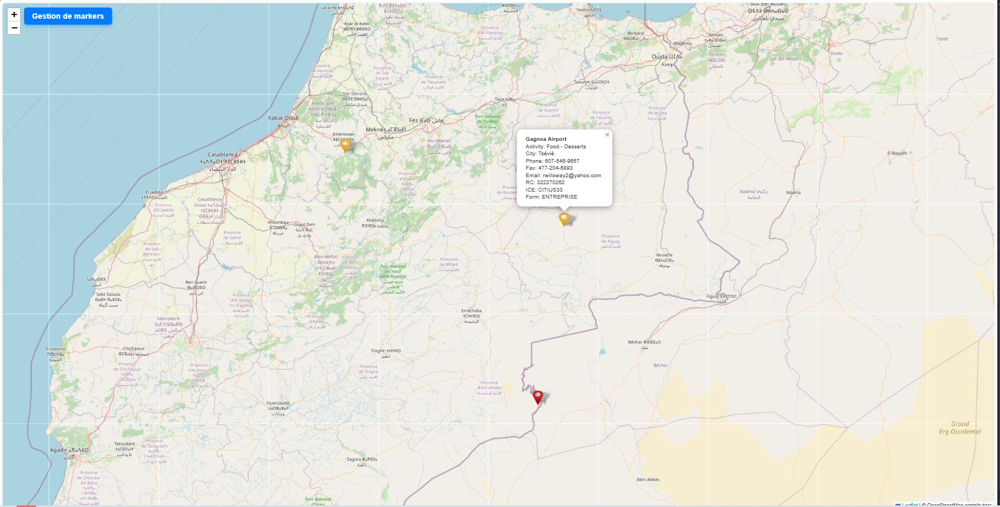
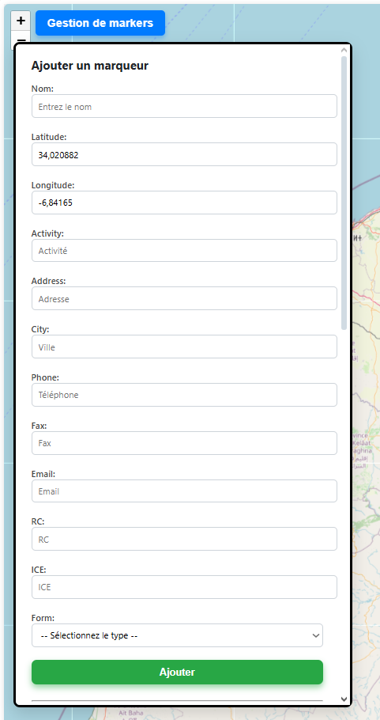
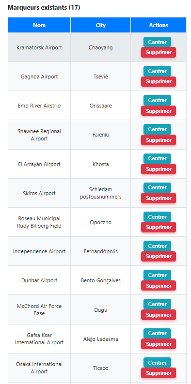

# Overview

Une application web interactive permettant d'ajouter, visualiser et gérer des marqueurs géolocalisés sur une carte, avec support de types (`COOPERATIVE`, `ENTREPRISE`, `ASSOCIATION`) et stockage en base de données MongoDB via un backend Python (Flask).

---

##  Technologies utilisées

- **Frontend** : Angular 20, Leaflet.js
- **Backend** : Python + Flask
- **Base de données** : MongoDB (local ou Atlas)
- **API** : REST (HTTP GET, POST, DELETE)

---

##  Fonctionnalités

- Visualisation d'une carte interactive (OpenStreetMap)
- Ajout de nouveaux marqueurs avec informations complètes :
  - Nom, latitude, longitude
  - Activité, adresse, ville
  - Téléphone, fax, email
  - RC, ICE
  - Type (`COOPERATIVE`, `ENTREPRISE`, `ASSOCIATION`)
- Affichage automatique sur la carte avec icônes personnalisées selon le type
- Centrage de la carte sur un marqueur
- Suppression d’un marqueur (depuis la carte et la base de données)
- Affichage du nombre de marqueurs existants

---

##  Screenshots

###  Map with Markers  


### L'ajout de markers


### Gestion des markers



##  Installation

### 1. Backend (Flask)

```bash

git clone https://github.com/https://github.com/AvoCahDoe/Leaf.git
cd back-leaf
python -m venv venv
source venv/bin/activate  # sous Windows : venv\Scripts\activate
pip install -r requirements.txt

```

### 2. Frontend (Angular)


```bash

git clone https://github.com/https://github.com/AvoCahDoe/Leaf.git
cd leaf
npm install
ng serve -o 
#Navigue vers http://localhost:4200

```

### 3. Global Tree

```bash
root/
│
├── backend/
│   └── app.py               # Flask backend
│
├── frontend/
│   ├── src/app/
│   │   └── cart-map.component.ts
│   │   └── map.html
│   │   └── map.scss
│   └── assets/
│       ├── blue.png         # Icone COOPERATIVE
│       ├── yellow.png       # Icone ENTREPRISE
│       ├── red.png          # Icone ASSOCIATION
│       └── leaf-shadow.png
│
├── README.md
```

### 4. MongoDB Entity Sample : 

```json
{
  "id": "unique-id",
  "name": "Nom du lieu",
  "lat": 34.02,
  "lng": -6.84,
  "activity": "Artisanat",
  "address": "123 Rue Exemple",
  "city": "Rabat",
  "phone": "0600000000",
  "fax": "0537000000",
  "email": "exemple@mail.com",
  "rc": "RC123",
  "ice": "ICE456",
  "form": "COOPERATIVE"
}

```


